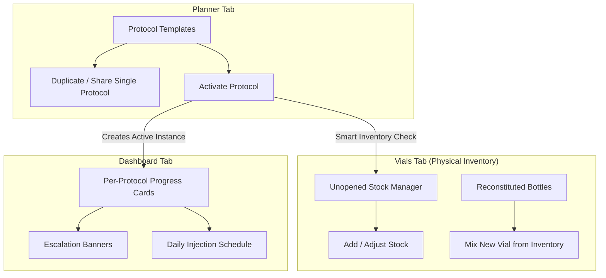

# PeptideApp Protocol Planner & Inventory Redesign - Master Execution Plan (`PLAN.md`)

This document serves as the master architectural specification, design document, and task roadmap for implementing **Peptide Protocols, Per-Protocol Progress Tracking, Inventory Architecture Redesign, and Protocol Template Sharing** in PeptideApp.

---

## 🎯 Confirmed Architecture & User Directives

> [!IMPORTANT]
> **Core Architectural Directives**:
> 1. **Vials Tab Architecture (Physical Inventory Hub)**: Re-architect `app/(tabs)/vials.tsx` to serve strictly as the **Physical Inventory & Stock Manager** (unopened vial inventory counts, reconstituted bottle stock, and stock adjustments), decoupling active protocol schedule tracking to the **Dashboard** and **Planner** tabs.
> 2. **Per-Protocol Progress Tracking**: Progress tracking (`Week X of Y (Z% Complete) • Phase N`) and escalation alert banners must be calculated **per active protocol instance** rather than as a single global progress bar.
> 3. **45-Day Shelf-Life Warning Threshold**: Reconstituted vial shelf-life expiration warning threshold updated to **$> 45$ days**.
> 4. **Smart Inventory Deduction**: When activating a protocol, check existing unopened inventory stock of matching mg and prompt the user to subtract available stock before adding new required inventory.
> 5. **Protocol Duplication & Sharing**: Support cloning protocol templates and exporting/importing single protocol JSON files.

---

## 🏗️ Architectural Workflow Diagram



---

## 📐 Data Schemas & Mathematical Formulation

### 1. Protocol & Titration Data Schema
```typescript
export interface TitrationPhase {
  id: string;
  phaseName: string;         // e.g., "Phase 1: Initiation", "Phase 2: Escalation"
  durationWeeks: number;     // Length of this phase in weeks
  doseAmount: number;        // Dose quantity
  doseUnit: 'mg' | 'mcg';    // Dose unit
  frequency: 'Daily' | 'Mon-Fri' | 'Specific Days' | 'Weekly';
  selectedDays?: string[];   // e.g. ['Mon', 'Thu']
  injectionsPerWeek: number; // Injections per week for this phase
}

export interface ReconstitutionSpec {
  vialMg: number;               // Mass of peptide per vial (e.g., 5mg, 10mg, 24mg)
  bacWaterMl: number;           // BAC water added per vial (e.g., 2ml)
  syringeCapacityUnits: number; // e.g. 100 Units (1ml U-100 syringe)
  wasteBufferPercent: number;   // Syringe safety buffer (default 10%)
}

export interface ProtocolConfig {
  id: string;
  name: string;              // e.g., "Retatrutide 24-Week TRIUMPH Protocol"
  notes?: string;
  phases: TitrationPhase[];  // Array of sequential titration periods
  reconstitution: ReconstitutionSpec;
  createdAt: string;
  isArchived?: boolean;
}

export interface PhaseCalculationResult {
  phaseId: string;
  phaseName: string;
  durationWeeks: number;
  totalInjections: number;
  totalMgNeeded: number;
  doseMcg: number;
  syringeUnitsPull: number;  // Syringe tick marks for U-100
}

export interface ProtocolSupplyResult {
  protocolId: string;
  totalDurationWeeks: number;
  totalInjectionsCount: number;
  totalPeptideMgRequired: number;
  vialsRequired: number;           // Math.ceil(totalPeptideMgRequired / vialMg)
  totalBacWaterMlRequired: number; // vialsRequired * bacWaterMl
  totalSyringesRequired: number;    // Math.ceil(totalInjectionsCount * (1 + wasteBufferPercent / 100))
  concentrationMgMl: number;
  phases: PhaseCalculationResult[];
  vialExpirationWarning: boolean;   // Flag if 1 reconstituted vial lasts > 45 days
}
```

### 2. Supply Calculation Formulas
- **Concentration**: $C = \frac{\text{Vial Mg}}{\text{BAC Water mL}}$
- **U-100 Syringe Pull**: $\text{Units} = \frac{\text{Dose Mcg}}{C \times 10}$
- **Total Vials Required**: $V_{\text{req}} = \lceil \frac{\text{Total Peptide Mg Required}}{\text{Vial Mg}} \rceil$
- **Total Syringes (+10% Buffer)**: $S_{\text{req}} = \lceil \text{Total Injections} \times (1 + \frac{\text{Buffer \%}}{100}) \rceil$
- **45-Day Expiration Flag**: $\text{Daily Consumption} = \frac{\text{Total Mg}}{\text{Total Days}}$. If $\frac{\text{Vial Mg}}{\text{Daily Consumption}} > 45$, flag warning.

---

## 🛠️ Detailed Component & File Specifications

### Component 1: Redesign Vials Tab as Physical Inventory Manager
#### [MODIFY] [app/(tabs)/vials.tsx](file:///Users/kcwire/workspace/PeptideApp/app/(tabs)/vials.tsx)
- Transform screen into **Physical Inventory & Stock Hub**:
  - **Stock Summary Header**: Cards showing Total Unopened Vials Stock, Reconstituted Bottles In Use, and Completed Vials.
  - **Unopened Inventory Manager**: Grouped list by compound (e.g. *Retatrutide 10mg — 8 Vials Available*), with `+ Add Stock` and `- Adjust` quick buttons.
  - **Reconstituted Bottles Section**: Active mixed vials available for injections with BAC water mix specs.
  - **Mix New Bottle Action**: Reconstitute an unopened vial from stock into an active bottle.

---

### Component 2: Per-Protocol Progress & Escalation Tracking
#### [NEW] [components/ProtocolProgressBanner.tsx](file:///Users/kcwire/workspace/PeptideApp/components/ProtocolProgressBanner.tsx)
- Render progress banner **per active protocol instance**:
  - `[██████░░░░░░░░░░░░░░] Week 6 of 24 (25% Complete) • Phase 2: Escalation`
  - **Escalation Alert**: Shown during transition weeks for that specific protocol:
    > 🚀 **Phase Transition This Week!**  
    > Target dose escalated from **1.0 mg** (20 Units) $\rightarrow$ **2.0 mg** (40 Units).

#### [MODIFY] [app/(tabs)/index.tsx](file:///Users/kcwire/workspace/PeptideApp/app/(tabs)/index.tsx)
- Render `<ProtocolProgressBanner />` cards for each active protocol instance on the Dashboard.

#### [MODIFY] [utils/protocolMath.ts](file:///Users/kcwire/workspace/PeptideApp/utils/protocolMath.ts)
- Update `vialExpirationWarning` threshold: flag if single reconstituted vial lasts **$> 45$ days**.

---

### Component 3: Smart Inventory Deduction on Activation
#### [MODIFY] [context/ProtocolContext.tsx](file:///Users/kcwire/workspace/PeptideApp/context/ProtocolContext.tsx)
- Update `convertProtocolToVials`:
  - Query unopened inventory count matching `protocol.reconstitution.vialMg`.
  - Calculate `unopenedAvailable`.
  - Prompt user with Smart Inventory Confirmation:
    - Required Vials: $N$
    - Available in Inventory: $M$
    - Additional Stock to Purchase/Add: $\max(0, N - M - 1)$.

---

### Component 4: Protocol Duplication & Single Protocol Sharing
#### [MODIFY] [context/ProtocolContext.tsx](file:///Users/kcwire/workspace/PeptideApp/context/ProtocolContext.tsx)
- Add `duplicateProtocol(id)`: Clones plan with `"[Name] (Copy)"` and fresh IDs.

#### [MODIFY] [app/(tabs)/protocol.tsx](file:///Users/kcwire/workspace/PeptideApp/app/(tabs)/protocol.tsx)
- Add **Duplicate 📑** button to protocol card menu.
- Add **Share 📤** button to export single protocol JSON via share sheet / clipboard.
- Add **Import Protocol 📥** button to import a single shared protocol JSON template.

---

## 📋 Task Board & Execution Progress

### Phase 1: Completed Core Infrastructure
- [x] **TASK-101**: Core Types & Pure Calculation Engine (`types/protocol.ts`, `utils/protocolMath.ts`)
- [x] **TASK-102**: Protocol State Provider & Active Vial Integration (`context/ProtocolContext.tsx`, `app/_layout.tsx`)
- [x] **TASK-103**: Titration Builder & Supply Summary Components (`components/TitrationPhaseBuilder.tsx`, `components/ProtocolSupplySummary.tsx`)
- [x] **TASK-104**: Router Screen & Navigation (`app/(tabs)/protocol.tsx`, `app/(tabs)/_layout.tsx`)
- [x] **TASK-105**: Multi-Day Persistence & Dynamic Date Titration Engine (`utils/protocolMath.ts`, `app/(tabs)/index.tsx`)
- [x] **TASK-106**: Full V2 Database Backup & Restore Engine (`app/(tabs)/settings.tsx`, `context/ProtocolContext.tsx`)

### Phase 2: Feature Enhancements & Inventory Redesign (Completed)
- [x] **TASK-201**: Update Expiration Warning Threshold to 45 Days (`utils/protocolMath.ts`, `components/ProtocolSupplySummary.tsx`)
- [x] **TASK-202**: Protocol Duplication & Single-Protocol Sharing / Import (`context/ProtocolContext.tsx`, `app/(tabs)/protocol.tsx`)
- [x] **TASK-203**: Smart Inventory Deduction Prompt on Protocol Activation (`context/ProtocolContext.tsx`)
- [x] **TASK-204**: Per-Protocol Progress Cards & Escalation Banners (`components/ProtocolProgressBanner.tsx`, `app/(tabs)/index.tsx`)
- [x] **TASK-205**: Vials Tab Architecture Redesign as Physical Inventory Manager (`app/(tabs)/vials.tsx`)
- [x] **TASK-206**: End-to-End Verification & Automated Test Suite Execution

---

## 🧪 Verification Plan

### Automated Unit Tests
- **Shelf-Life Threshold Test**: Verify warning fires at $>45$ days (and does not fire at $\le 45$ days).
- **Per-Protocol Progress Test**: Verify timeline calculations for concurrent protocols running on different start dates.
- **Smart Inventory Deduction Test**: Assert existing unopened stock is subtracted from purchase requirement.

### Manual Verification
- Test Vials tab inventory hub controls (adding stock, reconstituting bottle from stock).
- Test per-protocol progress cards and escalation banners on Dashboard.
- Test protocol duplication and single protocol export/import.
